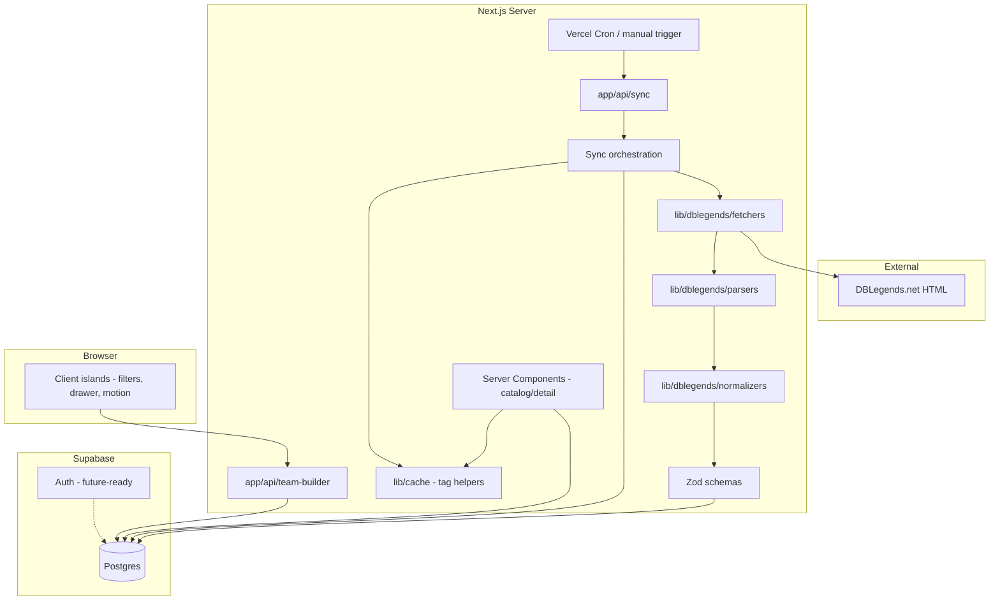

# Architecture — DB Legends Team Builder

## 1. Architecture decision summary

| Decision | Choice | Rationale |
|----------|--------|-----------|
| Framework | **Next.js 16 App Router** | RSC-first, route handlers, cache tags / ISR aligned with requirements |
| Language | **TypeScript strict** | Safety across parsers, DB boundary, and UI |
| Styling | **Tailwind CSS v4** | Token-driven design system, rapid UI iteration |
| UI primitives | **shadcn/ui** | Accessible base components; customized with glass tokens |
| Motion | **Motion** | Premium micro-interactions without owning animation primitives |
| Data | **Supabase Postgres** | Normalized storage, future auth/RLS, server-friendly |
| External data | **Server-only fetch** | Security, consistency, no client scrape |
| Validation | **Zod** | Runtime validation at normalization boundary |
| Caching | **Next.js cache tags + revalidate** | Invalidate catalog/detail after sync |

## 2. High-level system diagram

## 3. Layer separation (mandatory boundaries)

1. **Source fetching** (`lib/dblegends/fetchers/*`) — HTTP, retries, backoff, user-agent, timeouts; returns raw `FetchResult` (body + headers metadata). No cheerio/dom parsing here beyond optional status checks.
2. **Source parsing** (`lib/dblegends/parsers/*`) — HTML → **unstable** intermediate DTOs (loose fields, optional everything parsers can recover).
3. **Normalization** (`lib/dblegends/normalizers/*`) — Map intermediates → **canonical domain types**; fill slugs/ids; merge list vs. detail.
4. **Persistence** (`lib/db/*` + SQL migrations) — Upserts only through repository-style modules; **no** raw SQL in route handlers beyond thin delegation.
5. **Cache invalidation** (`lib/cache/*`) — `revalidateTag` helpers keyed by entity type / global catalog.
6. **UI consumption** — Server Components read DB via server-only modules; client components call **route handlers** for mutations and heavy interactive flows.

## 4. Sync orchestration

- **Single entrypoint** function (e.g. `runSyncPipeline`) invoked by:
  - `POST /api/sync` (admin secret / Supabase service role from server),
  - Vercel Cron hitting the same route with `CRON_SECRET`,
  - Optional Supabase Edge Function that proxies to the same logic (deployment doc).
- **Postgres advisory lock** (`pg_advisory_lock` with app-chosen keys) around the transactional “write phase” to prevent overlapping sync corruption.
- **Idempotency**: upsert by natural keys (`source_slug` or `source_url` hash); store `content_fingerprint` on `source_pages` and entity rows where applicable.

## 5. Routing structure (planned)

| Area | Path | Rendering |
|------|------|-----------|
| Marketing | `app/(marketing)/*` | Static / ISR where possible |
| App shell | `app/(app)/*` | RSC + client islands |
| Sync API | `app/api/sync/*` | Route handlers, no-cache |
| Team builder API | `app/api/team-builder/*` | Route handlers, validate body with Zod |

## 6. Security

- **Never** expose Supabase **service role** to the client.
- **Admin sync** gated by env secret or Vercel Cron header verification.
- **Rate limiting** (middleware or edge config) on sync triggers in production.
- **RLS** enabled on user-owned tables before public auth launch; migrations prep `saved_team_builds.user_id`.

## 7. Observability

- Structured logs for sync: run id, counts, duration, list page fingerprints, errors.
- `sync_runs` table stores status, metrics, error stack (truncated), trigger source.

## 8. Meta-ready extension points

- **Scoring** (`lib/scoring/*`) exposes pure functions + weight map; future “meta tier” becomes another signal with clear interface.
- **Matchup** module (future) consumes typed team + opponent element/tag features without changing UI contract of “explanation panel.”
