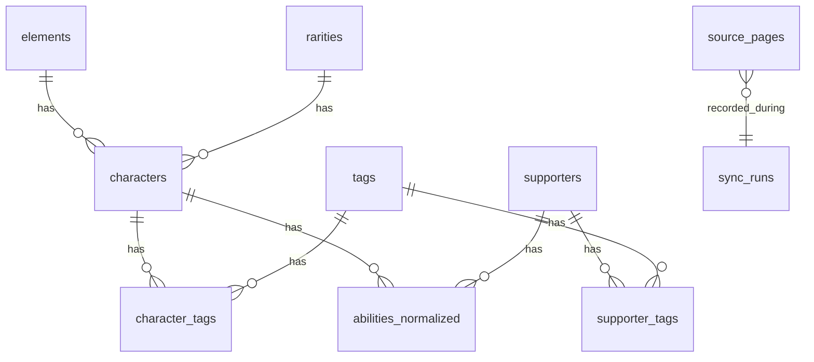

# Database schema (Postgres / Supabase)

## 1. Conventions

- **Primary keys**: UUID `id` default `gen_random_uuid()` unless noted.
- **Timestamps**: `created_at`, `updated_at` with `updated_at` maintained by trigger or application.
- **Soft deletes**: not used for catalog entities (source is truth); optional `archived_at` later.
- **Slugs**: `text not null unique` where exposed in URLs.

## 2. Reference tables

### `elements`

| Column | Type | Notes |
|--------|------|-------|
| id | smallserial | PK |
| code | text unique | e.g. `RED`, `BLU`, `GRN`, `YEL`, `PUR`, `LGT`, `DRK` |
| name | text | Display name |
| sort_order | int | UI ordering |

### `rarities`

| Column | Type | Notes |
|--------|------|-------|
| id | smallserial | PK |
| code | text unique | `LEGEND`, `ULTRA`, `SPARKING`, etc. |
| name | text | Display |
| tier_rank | int | For sort (higher = rarer) |

### `tags`

| Column | Type | Notes |
|--------|------|-------|
| id | uuid | PK |
| slug | text unique | Normalized from source |
| name | text | Display |

### `episodes`

| Column | Type | Notes |
|--------|------|-------|
| id | uuid | PK |
| slug | text unique | Saga / episode grouping |
| name | text | Display |

## 3. Catalog tables

### `characters`

| Column | Type | Notes |
|--------|------|-------|
| id | uuid | PK |
| slug | text unique | From source URL |
| name | text | |
| element_id | smallint | FK → elements |
| rarity_id | smallint | FK → rarities |
| zenkai | boolean | nullable if unknown |
| lf_ll | boolean | nullable |
| source_url | text | Canonical DBLegends.net URL |
| image_url | text | nullable |
| raw_excerpt | text | nullable small summary |
| content_fingerprint | text | Hash of normalized payload for drift logging |
| last_synced_at | timestamptz | |

### `supporters`

Same pattern as `characters` with supporter-specific nullable columns added in migrations as discovered (e.g. `passive_name`).

### `character_tags`

| character_id | uuid | FK |
| tag_id | uuid | FK |
| PK | (character_id, tag_id) | |

### `supporter_tags`

Same for supporters.

### `character_episodes` / `supporter_episodes` (optional v1)

Junction if episode data is reliable on list/detail pages.

### `abilities_normalized`

| Column | Type | Notes |
|--------|------|-------|
| id | uuid | PK |
| owner_type | text | check in `('character','supporter')` |
| owner_id | uuid | polymorphic reference |
| kind | text | `unique`, `main`, `zenkai`, `passive`, etc. |
| title | text | nullable |
| description | text | |
| order_index | int | |
| fingerprint | text | optional per-row hash |

Index: `(owner_type, owner_id)`.

## 4. Source and sync

### `source_pages`

| Column | Type | Notes |
|--------|------|-------|
| id | uuid | PK |
| url | text unique | |
| page_kind | text | enum-like |
| raw_hash | text | SHA-256 of body |
| fetched_at | timestamptz | |
| http_status | int | |
| parse_version | text | |
| parse_ok | boolean | |
| parse_error | text | nullable |

### `sync_runs`

| Column | Type | Notes |
|--------|------|-------|
| id | uuid | PK |
| started_at | timestamptz | |
| finished_at | timestamptz | nullable |
| status | text | `running`, `success`, `partial`, `failed` |
| trigger | text | `cron`, `manual`, `system` |
| stats | jsonb | counts, durations |
| error | text | nullable truncated |

## 5. User data (auth-ready)

### `saved_team_builds`

| Column | Type | Notes |
|--------|------|-------|
| id | uuid | PK |
| user_id | uuid | nullable until auth; FK → `auth.users` |
| name | text | User label |
| character_ids | uuid[] | ordered |
| supporter_id | uuid | nullable |
| score_snapshot | jsonb | optional last computed result |
| created_at / updated_at | timestamptz | |

**RLS (future):** `user_id = auth.uid()`.

## 6. Indexes (summary)

- `characters(element_id, rarity_id)`, `characters(name)` (trigram optional later).
- `GIN` on tag junctions for reverse lookups if needed.

## 7. ER diagram (conceptual)

## 8. Migration strategy

- Initial migration creates reference tables + `characters` + `supporters` + junctions + sync tables + `saved_team_builds`.
- Subsequent migrations only **add** columns; avoid destructive changes without backfill job.
